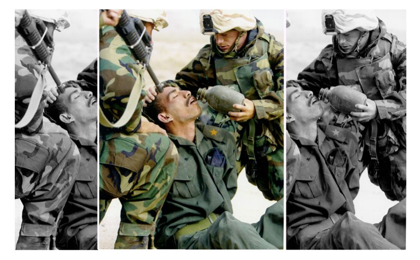

# Primärquelle Bild

Du hast ein Foto und möchtest prüfen, ob dies Fake ist?

Der einfachste Weg ist den Uploader direkt um mehr Informationen zu bitten. Geht das nicht oder misstraust du den Angaben, folgt hier der technische Weg:

## Originale Bildquelle finden

Es ist wichtig zu prüfen, woher das Foto kommt. Vielleicht zeigt es ein ganz anderes Ereignis oder nur einen Ausschnitt des Ereignisses?

Obiges Bild zeigt einen irakischen Soldaten umgeben von US-Soldaten während des Irak-Kriegs 2003. Es ist gut zu sehen, wie der linke oder der rechte Bildausschnitt die Wirkung des Fotos vollständig verändern. (Das Foto ist Teil der Wanderausstellung "X für U - Bilder, die lügen" und wurde von Ursula Dahmen erstellt.)

Zum Auffinden von optisch ähnlichen Fotos kannst du eine sogenannte Rückwärtssuche von Bildern verwenden:

* [TinEye](https://www.tineye.com/)
* [Google Image](https://images.google.com/)

Bei beiden kannst du entweder ein gespeichertes Foto hochladen oder ziehst ein Foto auf das Suchfeld. Das geht auch mit Fotos aus dem Browser. Einfach mit der Maus dort nach unten drücken, gedrückt halten, über den gewünschten Tab ziehen und dort dann in der Suchmaske loslassen.

Mehr dazu...

* [Manipulierte Bilder](http://www.spiegel.de/einestages/manipulierte-bilder-a-947326.html)

## Metadaten aus dem Bild auslesen

Manchmal hat man Glück und in den Foto stecken noch die originalen Metadaten. Beachte aber, dass diese auch entfernt oder geändert werden können.

Metadaten können Aufschluss über Aufnahmedatum, -ort oder verwendete Kamera geben.

Programme wie etwa [IrfanView](https://www.irfanview.com/) oder teilweise auch dein Dateimanager können diese sogenannte EXIF-Daten auslesen.

Alternativ geht das auch  online:

* [FotoForensics](https://www.fotoforensics.com/)
* [Find exif data](http://www.findexif.com/)

## Inhalte auf dem Foto überprüfen

### Alles Photoshop?

Hier und da ein wenig etwas verändern und schon ist das Foto gleich dramatischer. So etwas zu erkennen ist ziemlich schwierig und auch nicht immer eindeutig. Klar, manchmal siehst du offensichtlich, dass etwas nicht stimmt, dann ist Vorsicht geboten. Aber auch wenn nicht. Gut wären entweder weitere Fotos von dem Urheber oder besser von einem anderen Urheber aus einer anderen Perspektive.

### Wurde das Foto auch an dem Ort aufgenommen?

Wie finden wir heraus, ob das Foto wirklich an dem angegebenen Ort erstellt wurde? Im folgenden einige Hinweise, wie du den Ort eingrenzen kannst. Anschließend könntest du entweder selbst hinfliegen oder du nutzt einen Kartendienst, welcher Sateliten- oder Streetview-Aufnahmen hat. Dabei sind Google und Bing sicher die bekanntesten in Nordamerika und Europa. Etwa in China ist das etwa [baidu.com](https://map.baidu.com/)

* [Google Maps](https://www.google.com/maps/)
* [Bing Maps](https://www.bing.com/maps)
* [Baidu Maps](https://map.baidu.com/) 

#### Schilder prüfen

Sind auf dem Foto Orts- oder Straßenschilder zu sehen?

#### Schattenwurf validieren

Bist du dir bereits bei dem Datum sicher, kannst du anhand des Schattens von Objekten prüfen, ob diese zu dem Ort passen (siehe unten im nächsten Kapitel).

#### Ortsmarker prüfen

Gibt es charakteristische Elemente die den Ursprungsort weiter eingrenzen? Besondere Gebäude, Wahrzeichen, lokale Pflanzen/Tiere.

* [wikimapia](http://wikimapia.org) - Wähle eine Kategorie aus und finde alle Denkmäler, Schulen, Bahnhöfe etc. ganz schnell
* [Autokennzeichen](http://worldlicenseplates.com/)
* [Wikipedia](https://de.wikipedia.org/wiki/Wikipedia:Hauptseite)
* [Camopedia](https://camopedia.org/index.php?title=Main_Page) - lokale Militärtarnmuster

#### lokale Experten finden

Am einfachsten ist natürlich, wenn du jemanden kennst, der aus eigener Erfahrung bestätigen kann, dass dies dieser Ort ist.

#### Künstliche Intelligenz suchen lassen

Forscher der Leibnitz Universität haben ein neuronales Netzwerk darauf trainiert, nur anhand der sichtbaren Bereiche des Fotos den Standort zu bestimmen. Dies klappt manchmal exakt auf die Straße aber irrt sich auch manchmal im Kontinent. [Hier](http://openaccess.thecvf.com/content_ECCV_2018/papers/Eric_Muller-Budack_Geolocation_Estimation_of_ECCV_2018_paper.pdf) findest du den wissenschaftlichen Artikel dazu. 

* [Geolocation Estimation](https://labs.tib.eu/geoestimation/)

### Wurde das Foto auch an dem Tag aufgenommen?

EXIF-Daten kann man fälschen. Wie finden wir nun heraus, ob das Foto auch von dem Tag stammt? 

#### Schattenwurf validieren

Bist du dir bereits bei dem Ort sicher, kannst du anhand des Schattens von Objekten prüfen, ob diese zu dem Zeitpunkt passen.

* [SunCalc](https://www.suncalc.org/#/51.3407,12.3746,16/2019.01.08/10:02/1/0)

#### Das Wetter prüfen

Schnee in der Sahara oder einfach nur Regen an einem Sommertag? Nicht nur der Wettbericht sondern auch die tatsächlichen Wetterdaten sind online.

