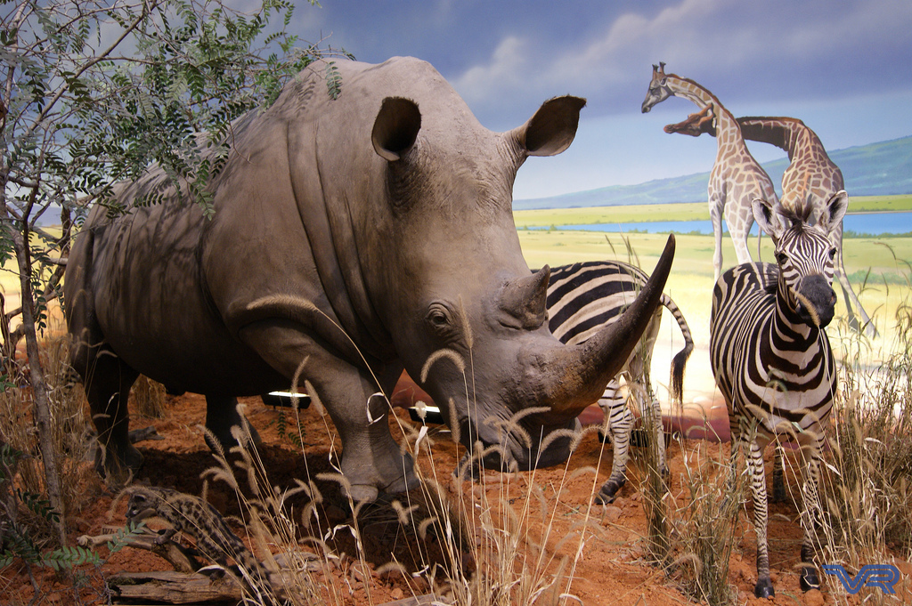
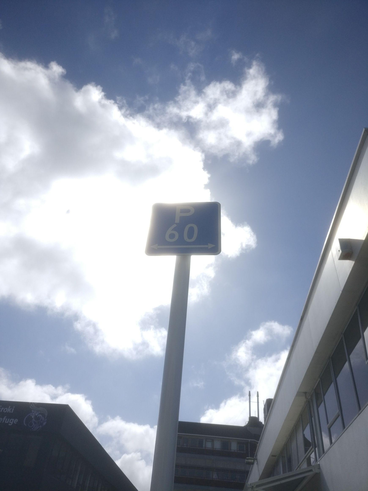
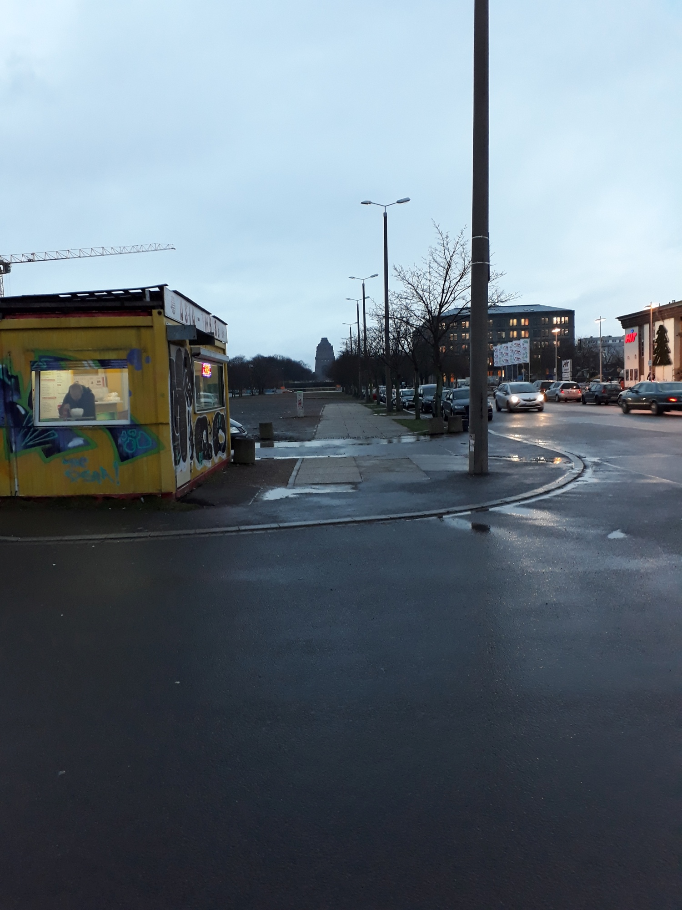
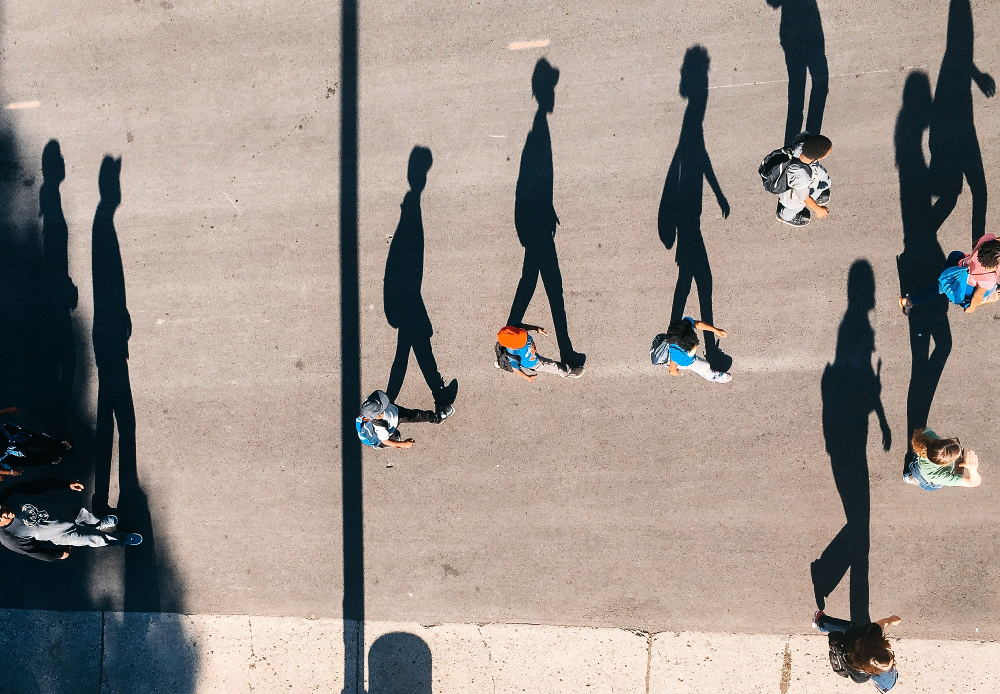
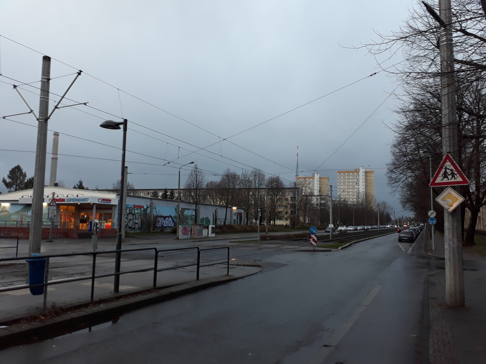
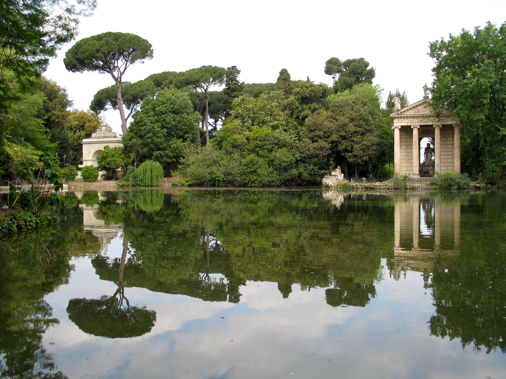
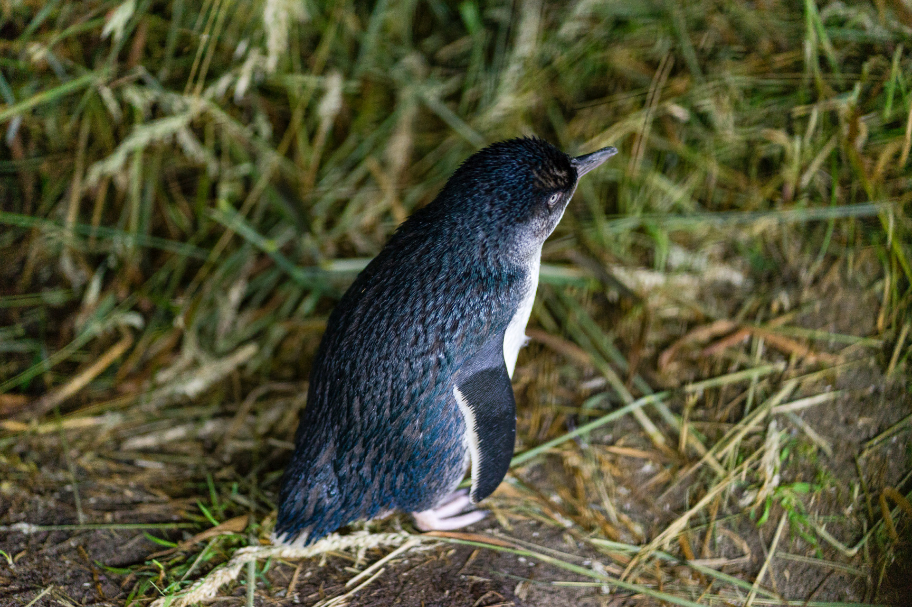

# Aufgaben

## Safari

Deine beste Freundin hat ein Safarifoto auf Instagram gepostet. Kann das stimmen?

(Foto ist [Neuwieser](https://www.flickr.com/photos/neuwieser/) unter CC BY-SA 2.0 veröffentlicht wurden)

## Schild

Wo markiert dieses Schild einen Parkplatz?

(Foto [CC BY-SA](https://creativecommons.org/licenses/by-sa/4.0/legalcode.de) von [WIssen](https://wi-wissen.de/) in Auftrag von Günther Müller)

## Stadtbild 1

Wo wurde dieses Foto aufgenommen?

## Menschen im Park

Der Fotograf sagt, dass man hier Menschen im Wisconsin State Fair Park am 1. August 2017 15:28 Uhr sieht. Stimmt das?

## Stadtbild 2

Wo wurde dieses Foto aufgenommen?

*Tipp: Der sehr schmale Turm im Hintergrund ist ein Funkturm.*

## Teich

In welcher Stadt befindet sich dieser Teich? 

(Foto unter [CC BY-NC-ND 2.0](https://creativecommons.org/licenses/by-nc-nd/2.0/) von [willi_bremen](https://www.flickr.com/photos/127321163@N04/) aufgenommen)

## Vogel

Günther Müller behauptet, dass er diesen Vogel selbst am Royal Albatross Centre in freier Wildbahn fotografiert hat. Du bist bei einer solch fantastischen Nahaufnahme skeptisch. Zum Glück hat [Günther Müller seine Smartphone-Daten veröffentlicht](https://apps.informatik.cc/tracking/). Suche Indizien dafür, dass Günther diesen Vogel tatsächlich fotografiert hat.

(Foto [CC BY-SA](https://creativecommons.org/licenses/by-sa/4.0/legalcode.de) von [WIssen](https://wi-wissen.de/) in Auftrag von Günther Müller)

