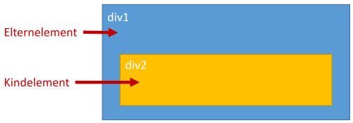

# Vererbung in CSS

Auch wenn es sich vielleicht zuerst etwas makaber anhört, Vererbung ist ein ganz wichtiges Prinzip in der Informatik. Keine Angst heute wird hier niemand sterben.

### Wer erbt hier von wem?

Wie auch im echten Leben erben Kinder von ihren Eltern. Bitte was?! Okay, klären wir erst einmal wo auf Webseiten Eltern und Kinder auftauchen: Sicher erinnerst du dich noch an die Verschachtelung von [HTML-Elementen](https://apps.wi-wissen.de/html-tutorial/04.html). Diese konnte ja ähnlich wie Matroschka-Figuren oder kleine Pakete ineinander gepackt werden.

Ein Element welches mindestens ein Element enthält nennt man Elternelement. Die Elemente innerhalb des Elternelements sind Kinderelemente. Haben diese Kinderelemente wiederum Kinderelemente, so sind sie gleichzeitig auch Elternelemente.

t> [Aufgabe](https://apps.wi-wissen.de/html-css-js-editor/cWCDs)

### Was wird geerbt?

[Hier](https://apps.wi-wissen.de/html-css-js-editor/hFdr4) hatten wir verschiedenfarbige `div`-Boxen ineinander geschachtelt. Dabei sind innerhalb des grünen Kasten zwei Kästen. Einer welche explizit einen roten Hintergrund bekommen hat und ein Kasten ohne eigenen Hintergrund. Dieser ist nicht etwa durchscheinend, sondern erbt die Hintergrundfarbe der übergeordneten `div`-Box. Man könnte auch sagen, die `div`-Box übernimmt die Werte der übergeordneten `div`-Box, sofern sie keine eigenen Werte an dieser Stelle definiert hat.

t> [Aufgabe](https://apps.wi-wissen.de/html-css-js-editor/Gj1cD)

Bis hierhin hat sich dir bsetimmt alles noch recht logisch erschlossen. 
Nun kommt das große ABER: Nicht alle Eigenschaften werden vererbt. So 
ist es zwar durchauch sinnvoll, dass etwa die Schriftart auf der ganzen 
Webseite gleich ist, aber etwa die Position im Dokument sollte nicht für
 jedes Kindelement gleich sein. 
​					
Spätestens beim Entwickeln deiner Webseite wirst du sehen, was 
sich vererbt und was nicht. Im Groben werden Eigenschaften des Textes 
und Farben vererbt. Kompliziertere Elemente, wie etwa aus [Layout mit CSS](https://apps.wi-wissen.de/html-tutorial/10.html) nicht. [Hier](http://www.thestyleworks.de/basics/inheritance.shtml) findest du einen etwas ausführlicheren Überblick und [hier](https://developer.mozilla.org/en-US/docs/Web/CSS/Reference) kannst du für jede Eigenschaft nachlesen.
​				