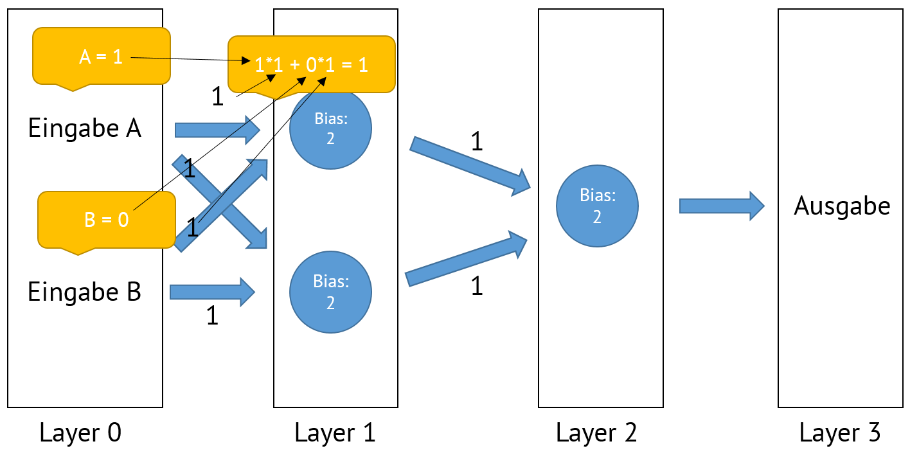
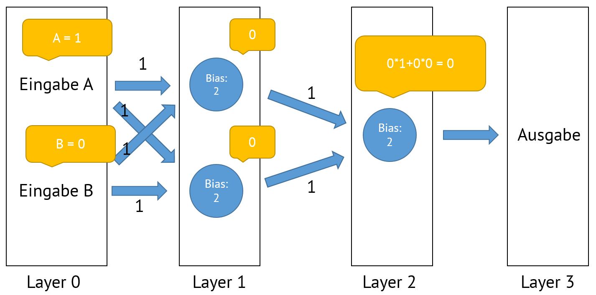

# Wie entscheidet ein Künstliches Neuronales Netzwerk?

In diesem Kapitel wollen wir uns an einem einfachen Beispiel ansehen, wie ein fertiges künstliches neuronales Netzwerk Entscheidungen trifft. 

i> Der [Film aus Grundlagen](https://youtu.be/cxCzhFVyUdw?t=46s) hilft hier sehr beim Verständnis.

#### graphische Darstellung zweier Fully Connected Layers

Um das Beispiel übersichtlich zu halten nehmen wir ein Bild, welches aus nur zwei Pixeln besteht. Wir wollen ermitteln, ob es beschrieben oder komplett leer ist. Mit nur zwei Pixeln müssen wir die Daten nicht weiter aufbereiten und können sofort durchstarten:

Legen wir also zwei sogenannte Layer an: 

An dieser Abbildung wird auch deutlich, warum es Fully Connected Layer heißt: Ein jeder Knoten aus einem Layer (Schicht) ist mit jeden anderen Knoten der nachfolgenden Schicht verbunden.

i> `Layer 0` ist die Eingabe und `Layer 3` die Ausgabe. Beide werden gemeinhin nicht mitgezählt.

Legen wir für den Anfang zufällig fest, welche Kantengewichte und Bias es geben:

i> Die hier angeschriebenen Zahlen sind das was wir im letzten Abschnitt in die farbigen Linien geschrieben haben.

Jetzt führen wir die schon eingangs beschriebene Berechnung durch:

Wir rechnen also`1*1 + 0*1 = 1 `. Da `1` kleiner als `2` ist, reicht dies nicht aus, um den Knoten zu "aktivieren". In unserem Rechenbeispiel erhält er daher den Wert 0.

i> Im [Video](https://youtu.be/cxCzhFVyUdw?t=46s) wurde dies durch zwei notwendige Tennisbällt (Bias) dargestellt. Mathematisch haben wir dies eingangs wie folgt gelöst: `1*1 + 0*1 + 2*-1 = -1 `. Nanu, wo kommt denn `2*-1` her? `2` ist der Bias von`Layer 1`. Klar. Und für `Layer 0` setze ich immer den Bias von `-1`. Und schon erhalte ich nur ein positives Ergebnis, wenn der Bias von `Layer 1` kleiner als das Summenprodukt der einzelnen Knoten und Kanten ist. Sicher hast du schon eine Idee, was wir mit negativen Werten machen würden. Ob du richtigst liegt erfährst du im nächsten Abschnitt.

Mit diesem Wissen können wir noch den `Layer 2` ausrechen:

Unser Ergebnis ist `0`. Das ist unschön, da wir eigentlich eine `1` für bemalt und eine `0` für noch leer hätten. Unser künstliches neuronales Netz ist also noch nicht richtig trainiert.

t> Was muss geändert werden, damit unser künstliches neuronales Netz die Bilder richtig erkennt?
