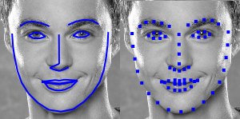
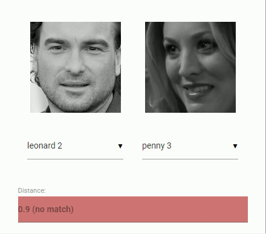
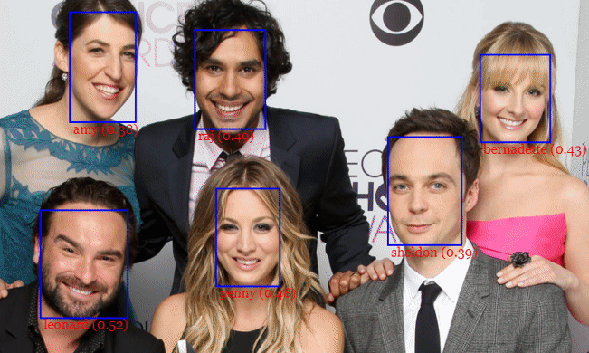

# Gesichtererkennung

Wir können uns hier ein Beispiel ansehen, wie Gesichter erkannt werden. Die Beispiele kannst du dank der [face-api.js](https://github.com/justadudewhohacks/face-api.js) von [justadudewhohacks](https://github.com/justadudewhohacks) [**hier**](https://justadudewhohacks.github.io/face-api.js/face_and_landmark_detection) ausprobieren. (Beachte, dass dafür wirklich viele Daten runtergeladen werden müssen.)


Gesichter zu erkennen lässt sich praktisch in drei Schritte einteilen:

1. Gesichter verorten
2. Gesichter normalisieren
3. Gesichter einer Gruppe von bekannten Gesichtern zuordnen

Der erste Schritte ist der einfachste. Schon recht alte digitale Kameras konnten Gesichter aufgrund ihrer Form auf Bildern identifizieren.


Im zweiten Schritt soll das Gesicht so gedreht und zugeschnitten werden, dass nur die für den dritten Schritt relevanten Teile zu erkennen sind. Dazu werden die folgenden markanten Punkte ermittelt:



So sieht dann in etwa das Ergebnis aus:


Jetzt werden die Gesichter mit einer Auswahl (hier sind es 20, für ein Video wären mehrere hundert gut) verglichen:



Das Endergebnis kann dann etwa wie folgt visualisiert werden:



w> Alle Bilder sind Eigentum der jeweiligen Urheber. [Der vollständige Artikel](https://itnext.io/face-api-js-javascript-api-for-face-recognition-in-the-browser-with-tensorflow-js-bcc2a6c4cf07) ist auf englisch bei itnext.io verfügbar.


## lokal Ausprobieren

i> Hier ist eine [Online-Demonstration](https://justadudewhohacks.github.io/face-api.js/face_and_landmark_detection).

**Vorbereitung**

Installiere [node](https://nodejs.org/de/) und [git](https://git-scm.com/downloads)

Öffne eine Kommandozeile (etwa im Startmenu nach `cmd` suchen) und gib folgende Befehle ein:

w> Alle Dateien werden in den aktuellen Ordner gelegt. Das ist oft `C:\User\DEINNAME`. Möchtest du das nicht, musst du den Ordner wechseln oder die Dateien im Anschluss löschen.

```bash
git clone https://github.com/justadudewhohacks/face-api.js.git
cd examples
npm i
npm start
```

Jetzt kannst du <http://localhost:3000/> aufrufen und mit kurzer Verzögerungszeit die Gesichtserkennung beim Arbeiten beobachten.