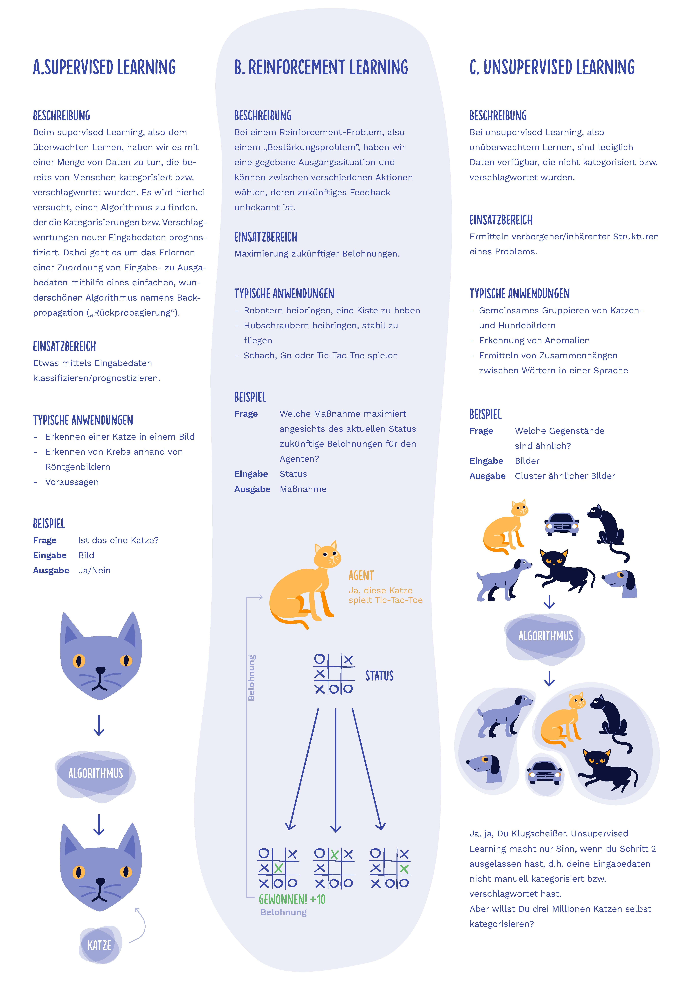

# Künstliche Intelligenz 

Das Wort künstliche Intelligenz ist in aller Munde. Was damit gemeint ist, ist aber garnicht so klar. In den Medien sind damit meist Assistenten, wie etwa Siri, Alexa oder Google gemeint, mit welchen man sprechen kann. Aber auch abseits davon soll es sie geben: Künstliche Intellligenz [bedient Waffen](https://www.tagesschau.de/ausland/usa-waffen-111.html), [erkennt Krebs](http://www.faz.net/aktuell/wirtschaft/kuenstliche-intelligenz-soll-krebs-diagnostizieren-15054102.html) oder [malt Bilder](https://www.zdf.de/nachrichten/heute/macht-kuenstliche-intelligenz-kuenstler-ueberfluessig-100.html).

t> Schau dir das Video an, wenn du jünger als 14 Jahre bist:

<iframe width="560" height="315" src="https://www.youtube-nocookie.com/embed/unAdsyOZB9c" frameborder="0" allow="accelerometer; autoplay; encrypted-media; gyroscope; picture-in-picture" allowfullscreen></iframe>

t> Schau dir das Video an, wenn du mindestens 14 Jahre bist:

<iframe width="560" height="315" src="https://www.youtube-nocookie.com/embed/3RsmRMqX2IY" frameborder="0" allow="accelerometer; autoplay; encrypted-media; gyroscope; picture-in-picture" allowfullscreen></iframe>

## Ziel dieses Kapitels

Dabei werden wir die folgenden Etappen meistern:

1. Grundlegendes Arbeiten und Lernen eines Neuronales Netzwerkes
2. Grundlagen mit TensorFlow.js ausprobieren
3. Wie funktioniert Gesichtererkennung?
4. Einstieg in eigene Werke mit neuronalen Netzen dank ml5.js

Technisch gesehen werden sogenannte künstliche Intelligenzen mit künstlichen neuronalen Netzwerken umgesetzt. 

## Künstliche Intelligenz, Machine Learning, Deep Learning, Wackelpudding

Der Begriff Künstliche Intelligenz ist schwer zu fassen, da unklar ist, was eigentlich Intelligenz bedeutet. Versuche doch einfach mal selbst zu beschreiben, was wirklich intelligent ist. Also bist du intelligent? Ist eine Schildkröte die auf tausende Kilometer ihre Geburtsinsel wiederfindet intelligent? Eine Ameisenkollone, die Straßen baut?

Um es ein wenig einzugrenzen, haben wir zwei Arten geschaffen:

* starke künstliche Intelligenz: Ein Programm, welches einmal trainiert in allen Bereichen gut zurechtkommt. Wie etwa ein Mensch Rasen mähen und im Chor singen kann.
* schwache künstliche Intelligenz: Ein Programm, welches einmal trainiert in dem trainierten Bereich gut zurechtkommt. Etwa [AlphaZero](https://www.heise.de/newsticker/meldung/Kuenstliche-Intelligenz-AlphaZero-meistert-Schach-Shogi-und-Go-3911703.html), welches jeden Menschen in Schach schlägt.

Starke künstliche Intelligenz gibt es bisher nur bei Lebewesen. Wir werden und hier mit schwacher künstlicher Intelligenz auseinandersetzen. 

Wenn man einen Rechner normalerweise programmiert gibt ein Entwickler ganz konkrete Befehle (einen Algorithmus) ein, welcher nach bestimmten Regeln bei gleicher Eingabe in endlicher Zeit zu immer den gleichen Ergebnis kommt. Nur hat sich leider herausgestellt, dass es wirklich verdammt schwer ist zu erklären, wie ein Mensch einen Hund von einer Katze unterscheiden kann. Daher wurde der Ansatz Machine Learning entwickelt. Hier werden statistische Methoden verwendet, um das menschliche Verhalten nachzubilden. Moment Statistik? Das ist doch Mathe. Genau. Und du erinnerst dich, das sind Wahrscheinlichkeiten. Also steckt hier eigentlich schon drin, dass der Rechner sich beim Machine Learning auch ab und zu irren wird.

Machine Learning gliedert sich in drei große Bereiche:

(Bild von [Iskender Dirik](https://id.vc/) und [Microsoft](https://news.microsoft.com/de-de/deep-learning-whitepaper/))

Fairerweise muss gesagt werden, dass Unsupervised Learning nicht nur mit Katzen und Hunden funktioniert. So ist es etwa super spannend das Einkaufsverhalten in Online-Shops zu beobachten. Für einen Menschen das pure Chaos, aber für einen Rechner durchaus nachvollziehbar. Klar, dass jemand der Zahnpaste kauft vermutlich auch eine Zahnbürste kauft, aber was kaufen eigentlich Menschen die einen Panda-Blumentopf kaufen?

(Screenshot von Amazon.de)

## Geschichte der KI

<iframe width="560" height="315" src="https://www.youtube-nocookie.com/embed/09LotPHTZtU" frameborder="0" allow="accelerometer; autoplay; encrypted-media; gyroscope; picture-in-picture" allowfullscreen></iframe>

## Wie das Gehirn lernt

i> In diesem Kapitel wird davon ausgegangen, dass bereits grundlegend bekannt ist, wie das Gehirn grundlegend lernt. Die Inhalte sind aber auch ohne dieses Wissen gut verständlich.

Hier ist eine kleine Wiederholung aus dem Biologieunterricht:

<iframe width="560" height="315" src="https://www.youtube-nocookie.com/embed/EGKTH60rvoU?rel=0" frameborder="0" allow="autoplay; encrypted-media" allowfullscreen></iframe>
