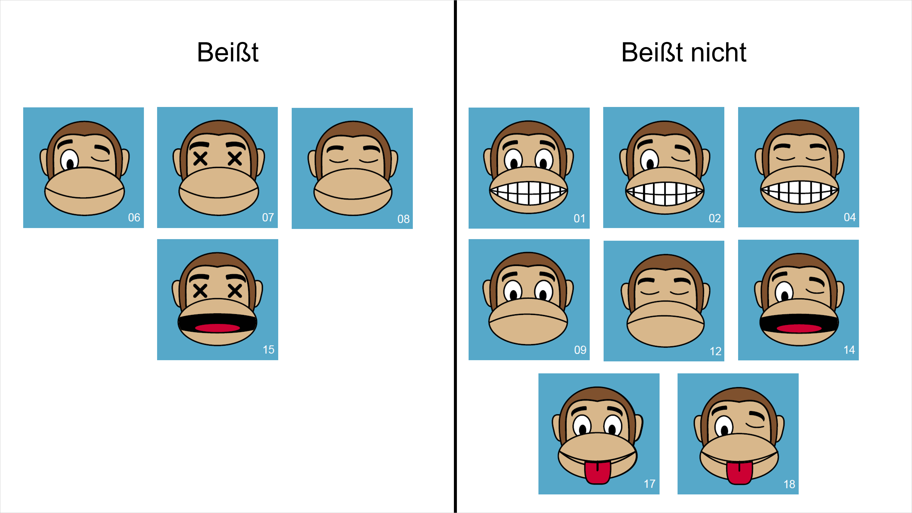
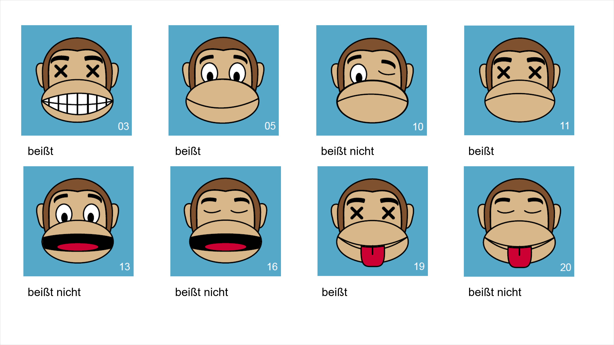

# Welche Affen beißen?

Als Zoowärter\*in ist es sehr wichtig zu wissen, welche Affen einen beißen könnten und welche nicht. Stell dir vor ein Affe bittet dich darum, ihm oder ihr die Zähne zu putzen und beißt dich dann. Daher haben Zoowärter\*innen gelernt, beißende Affen zu erkennen. Aber schafft das auch eine künstliche Intelligenz?

Hier haben wir die Untersuchungen von der Zoowärterin Ava:

<figcaption>
Grafik von [AI unplugged](https://ddi.cs.fau.de/schule/ai-unplugged/) unter CC-BY-NC
</figcaption>

Super. Jetzt irgendwas mit Bilderkennung und dann fertig? Nein, das wäre wirklich schwierig für den Rechner. Wir können es vereinfachen. Wenn wir uns die Affen ansehen, dann stellen wir fest, dass sie sich nur in Mund- und Augenpartien unterscheiden:

| Mund    | Augen    | Beißt |
| ------- | -------- | ----- |
| lächeln | zwinkern | ja    |
| lächeln | verrückt | ja    |
| lächeln | zu       | ja    |
| offen   | verrückt | ja    |
| grinsen | offen    | nein  |
| grinsen | zwinkern | nein  |
| grinsen | zu       | nein  |
| traurig | offen    | nein  |
| traurig | zu       | nein  |
| offen   | zwinkern | nein  |
| zunge   | offen    | nein  |
| zunge   | zwinkern | nein  |

Mit der Seite Machine Learning for Kids möchten wir einem Rechner beibringen anhand dieser Beobachtungen beißende von nichtbeißenden Affen zu unterscheiden.

i> Expertenaufgabe: Erkennst du schon eine Regel?

<iframe width="560" height="315" src="https://www.youtube-nocookie.com/embed/RlGb7N13wjM?origin=https://buch.informatik.cc&amp;iv_load_policy=3&amp;modestbranding=1&amp;playsinline=1&amp;showinfo=0&amp;rel=0&amp;enablejsapi=1" frameborder="0" allow="accelerometer; autoplay; encrypted-media; gyroscope; picture-in-picture" allowfullscreen></iframe>

<figcaption>Video bei <a href="https://youtu.be/RlGb7N13wjM">YouTube</a> ansehen </figcaption>

Super. Wir haben ein sogenanntes Modell der Wirklichkeit erschaffen. Jetzt müssen wir prüfen, ob es auch richtig ist. Zum Glück nur digital und nicht, indem wir jeden Affen die Hand in den Mund stecken. 😀

<figcaption>
Grafik von [AI unplugged](https://ddi.cs.fau.de/schule/ai-unplugged/) unter CC-BY-NC
</figcaption>

<iframe width="560" height="315" src="https://www.youtube-nocookie.com/embed/9j4EyRT03OU?origin=https://buch.informatik.cc&amp;iv_load_policy=3&amp;modestbranding=1&amp;playsinline=1&amp;showinfo=0&amp;rel=0&amp;enablejsapi=1" frameborder="0" allow="accelerometer; autoplay; encrypted-media; gyroscope; picture-in-picture" allowfullscreen></iframe>

<figcaption>Video bei <a href="https://youtu.be/9j4EyRT03OU">YouTube</a> ansehen </figcaption>

Hast du gemerkt, dass in dem Video andere Bilder als zuvor verwendet wurden? Das nennt man Testdaten. Zuvor haben wir mit Trainingsdaten geübt. Da sind wir ziemlich sicher, dass die künstliche Intelligenz da Regeln gefunden hat, aber entscheidend ist, wie die KI mit neuen also unbekannten Situationen umgehen kann. Daher haben wir dafür andere Daten - die Testdaten.

Weil wir für die Affen mit den Mündern und Augen ein so einfaches Modell gefunden haben, können wir der KI als letzten Schritt in den Kopf schauen. Dabei werden wir einen sogenannten Entscheidungsbaum entdecken.

<iframe width="560" height="315" src="https://www.youtube-nocookie.com/embed/GWXMnccckmc?origin=https://buch.informatik.cc&amp;iv_load_policy=3&amp;modestbranding=1&amp;playsinline=1&amp;showinfo=0&amp;rel=0&amp;enablejsapi=1" frameborder="0" allow="accelerometer; autoplay; encrypted-media; gyroscope; picture-in-picture" allowfullscreen></iframe>

<figcaption>Video bei <a href="https://youtu.be/GWXMnccckmc">YouTube</a> ansehen </figcaption>

i> Zeichne einen Entscheidungsbaum, was du für den Schulweg anziehst, jenachdem ob es regnet, nicht regnet, Sommer oder Winter ist.