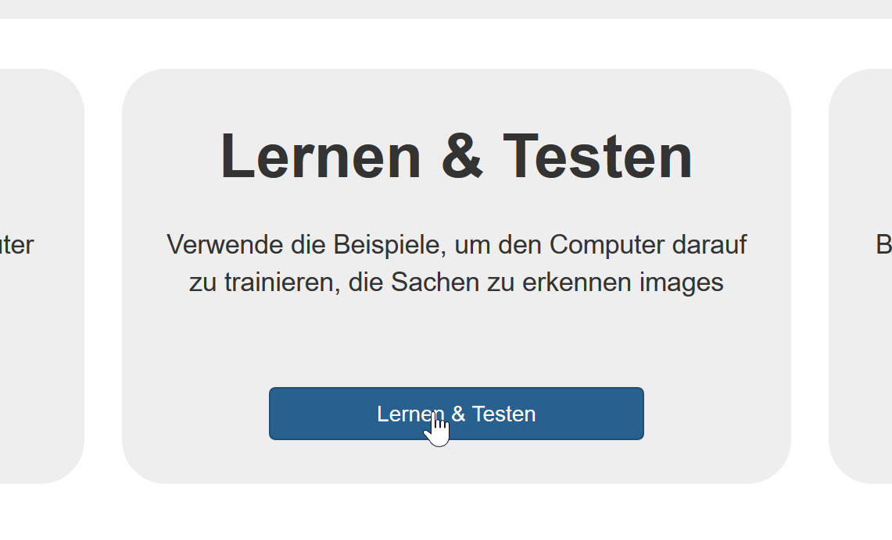
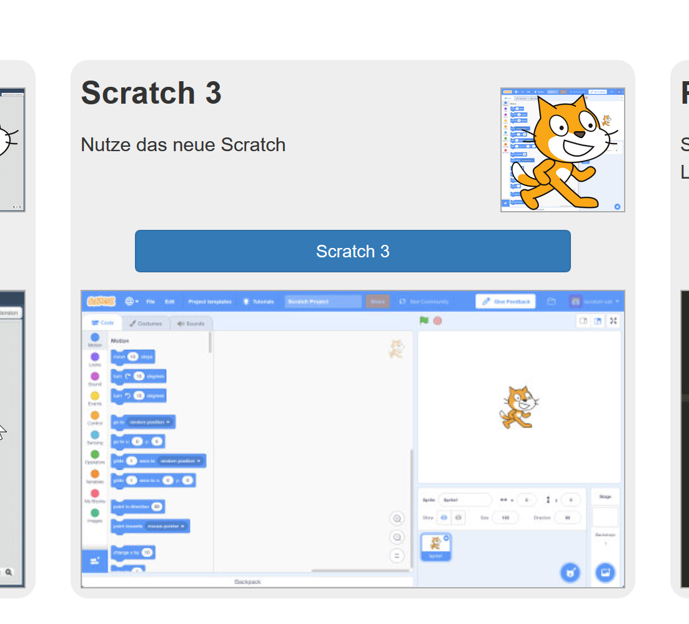

# Tasse oder Fahrrad, das ist hier die Frage

Gesichter ist einfach, aber wie gut kann eine KI zwischen einem Fahrrad und einer Tasse unterscheiden? Lass uns gemeinsam Bilder sammeln und beobachten, was passiert.

### Vorbereitung

i> Frage vorher dein/e Lehrer\*in, ob sie schon das Projekt vorbereitet hat.

Wenn nicht, kannst du im Kapitel *Welche Affen beißen?* schauen, wie das auf [Machine Learning For Kids](https://machinelearningforkids.co.uk/) geht.

### Bilder sammeln

Hier darfst du ausnahmsweise Bilder direkt aus einer Bildersuchmaschine verwenden.

<iframe width="560" height="315" src="https://www.youtube-nocookie.com/embed/yc6krPureEE?origin=https://buch.informatik.cc&amp;iv_load_policy=3&amp;modestbranding=1&amp;playsinline=1&amp;showinfo=0&amp;rel=0&amp;enablejsapi=1" frameborder="0" allow="accelerometer; autoplay; encrypted-media; gyroscope; picture-in-picture" allowfullscreen></iframe>

<figcaption>Video bei <a href="https://youtu.be/yc6krPureEE">YouTube</a> ansehen </figcaption>

### Trainieren

Hatte dein/e Lehrer\*in das Projekt vorbereitet, dann trainiert sie/er das Modell. Sonst kannst du das auch einfach unter [Trainieren]() erstellen:

### Model prüfen

Unter *Machen* kannst du ein Scratch 3 Projekt auswählen. 

Öffne dann diese Datei:

[Download Scratch-Projekt](/ki/assets/Fahrrad-oder-Tasse-Scratch-Projekt.sb3 ':ignore')

Jetzt kannst du über die grüne Fahne das Projekt starten und beobachten, ob die Objekte richtig nach links oder rechts geschoben werden.