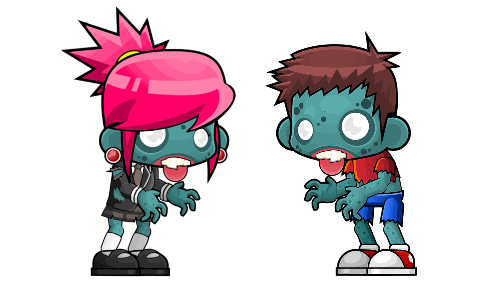

# Die Zombie-Flucht

Gestern haben sich alle Schüler\*innen und Lehrer\*innen in der Jugendherberge auf den leckeren Spinat gestürzt und jetzt das! Alle sind über Nacht zu Zombies mutiert! 😱 Einzig du, deine Freund\*innen und die/der Informatiklehrer\*in seid verschont wurden. Warum? Ihr habt vorbildlich auf eure/n Lehrer\*in gehört und ausschließlich den Schokopudding gegessen. Während ihr eure Zimmertür mit einem Schrank verbarrikadiert, hört ihr eure/n Informatiklehrer\*in vor eurem Fenster euch begeistert rufen. Sie/er hat es geschafft und ist den Zombies entkommen. Alles ganz einfach ruft er/sie euch zu. Eure/r Informatiklehrer\*in wirft euch einen Staubsaugroboter zu und erzählt: *Damit war es ein klacks. Ich konnte alle Zimmer erkunden, schnell eine künstliche Intelligenz trainieren und mich dann durch das Haus schleichen, während meine KI mir sagte, welche Türen ich öffnen darf. Ihr müsst unbedingt wissen, dass Zombies auf keinen Fall...* Doch da taucht ein Zombie auf, welcher früher Valentin hieß und dein/e Informatiklehrer\*in muss flüchten.

## Was mögen Zombies?

Zombies sind ja auch wählerisch. Jetzt nicht mehr bei ihrem Aussehen, aber sie fühlen sich in verschiedenen Zimmern und Gängen dann doch unterschiedlich wohl. Nur leider wissen wir nicht in welchen! Zum Glück kann unser Staubsaugroboter verschiedene Eigenschaften eines Raums erkennen:

* Leuchtmittel - Hängt an der Decke eine LED-Lampe, Halogenröhre, Glühbirnen, Kerze oder keine Lampe?
* Temperatur in °C
* Bodenbelag - Muss hier Teppich, Laminat, Stein, Fliesen oder Holz gereinigt werden?
* Raumgröße in m^2
* Helligkeit in Lux
* Anzahl der Spiegel (Zombies sind ja keine Vampire 😉)
* Luftfeuchtigkeit in %
* Wandfarbe - Schwarz, Braun, Grau, Weiß, Gelb
* Anzahl der Stühle
* Anzahl der Fenster
* Lautstärke in Dezibel
* Raumnummer

Leider können wir nur 5 der Sensoren auf einem Rundgang des Staubsaugroboters verwenden, sonst ist der Speicher zu schnell voll.

i> Wähle 5 Sensoren aus, wo du denkst, dass die auch für Zombies wichtig sind. Wenn du dir unsicher bist, kannst du natürlich auch einen Zombie aus deinem Bekanntenkreis fragen.

## Den Staubsaugroboter Zombies suchen lassen

Auf [Machine Learning for Kids](https://machinelearningforkids.co.uk/) können wir in einer Simulation unseren Staubsaugroboter tatsächlich auf seine Mission durch die Jugendherberge schicken.

Du benötigst die folgende Welt, für deinen Staubsaugroboter:

[Download Scratch-Projekt](/ki/assets/Zombie-Scratch-Projekt.sb3 ':ignore')

Bitte führe die folgenden Schritte genau so aus. Weiche nur beim Anlegen der Sensoren so ab, dass du deine eigenen Sensoren verwendest:

<iframe width="560" height="315" src="https://www.youtube-nocookie.com/embed/wNn2BkHbS1I?origin=https://buch.informatik.cc&amp;iv_load_policy=3&amp;modestbranding=1&amp;playsinline=1&amp;showinfo=0&amp;rel=0&amp;enablejsapi=1" frameborder="0" allow="accelerometer; autoplay; encrypted-media; gyroscope; picture-in-picture" allowfullscreen></iframe>

<figcaption>Video bei <a href="https://youtu.be/wNn2BkHbS1I">YouTube</a> ansehen </figcaption>

## Die KI trainieren

Da kein Zombie deinen Staubsaugroboter gefressen hat, konnten wir in dem letzten Video uns ansehen, wie man das Modell mit den gesammteln Daten trainieren kann.

Lies dir das Kapitel zu den Affen durch, wenn du wissen möchtest, was da passiert.

## Die Flucht!

Du hast ein gutes Gefühl? Dann wage die Flucht! Folge immer wie im folgenden Video gezeigt den Empfehlungen der künstlichen Intelligenz:

<iframe width="560" height="315" src="https://www.youtube-nocookie.com/embed/74Pd-ON394c?origin=https://buch.informatik.cc&amp;iv_load_policy=3&amp;modestbranding=1&amp;playsinline=1&amp;showinfo=0&amp;rel=0&amp;enablejsapi=1" frameborder="0" allow="accelerometer; autoplay; encrypted-media; gyroscope; picture-in-picture" allowfullscreen></iframe>

<figcaption>Video bei <a href="https://youtu.be/74Pd-ON394c">YouTube</a> ansehen </figcaption>

Beide Knöpfe sind grün? Dann ist es hinter beiden Türen sicher. Beide Köpfe sind blau? Dann wird wohl hinter beiden ein Zombie lauern. Also Luft anhalten, Tischtennisschläger in Verteidigungsstellung bringen und mutig das Zimmer betreten.

Deine Flucht war erfolgreich? Du Zombieflüster\*in! Wenn nicht: Probier doch andere Sensoren aus. Du kannst dir auch wie bei den Affen anschauen, was im Kopf deiner KI passiert.

