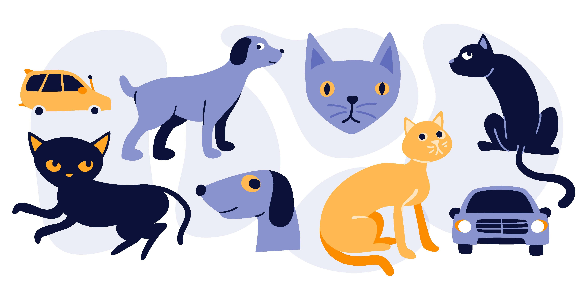
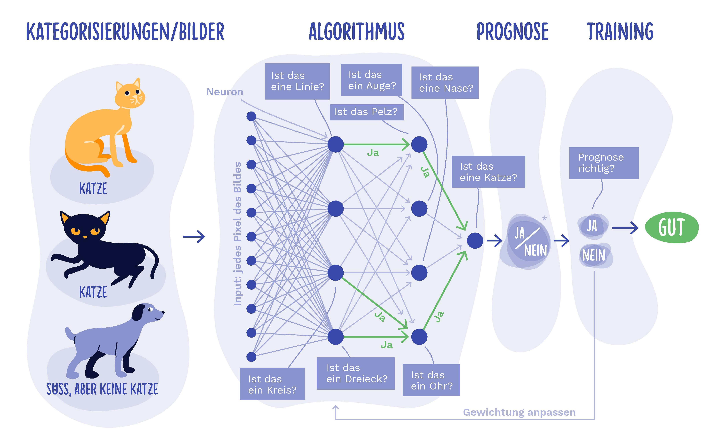

# Überblick Bilder erkennen

In diesen Beispiel lernen wir, wie wir Hunde von Katzen unterscheiden können.

(Bild von [Iskender Dirik](https://id.vc/) und [Microsoft](https://news.microsoft.com/de-de/deep-learning-whitepaper/))

Ganz grob können wir uns den Vorgang so vorstellen:

(Bild von [Iskender Dirik](https://id.vc/) und [Microsoft](https://news.microsoft.com/de-de/deep-learning-whitepaper/))

Wir haben Eingangsbilder die durch ein Neuronales Netz (du erinnerst dich an [das Video](https://youtu.be/cxCzhFVyUdw?t=46s)?) interpretiert werden. Dazu werden sehr viele kleine Entscheidungen getroffen. Anschließend stellt der Rechner eine Prognose. Dazu erhält er eine Rückmeldung, welche bestimmt, ob der die aktuelle Prognose beibehalten sollte oder nicht. Das wiederholen / trainieren wir so lange, bis wir mit der Genauigkeit zufrieden sind. 

Nur woher wissen wir wie gut wir wirklich sind? Genau wir üben einfach an einer Menge an Hunde- und Katzenbildern und wenn wir darin gut sind, dann testen wir unser Ergebnis an neuen Bildern, die wir davor noch nicht gesehen haben (Ähnlich einer Leistungskontrolle). Hier zeigt sich, ob wir es tatsächlich geschafft haben allgemeine Merkmale von Hunden und Katzen zu ermitteln, oder ob wir nur anhand zu spezifischer Merkmale des Fotos (etwa der Hintergrundfarbe) identifizieren konnten.

Warum haben wir uns zuerst Linien angesehen? Nun, wir bauen die einzelnen Merkmale des Bildes aufeinander auf. Aus verschiedenen Linien und Kreisen kann etwa ein Auge oder eine Topfpflanze entstehen. Guter Trick was? Darf ich dir ein Geheimnis verraten? Darauf kommen die Neuronalen Netzwerke von allein. Also welche Eigenschaften genau betrachtet werden und wie sie sich zusammen setzen, dass lernen die Neuronalen Netzwerke auch selbst.

t> Probiere das Bildererkennen praktisch bei [Machine Learning for Kids](https://machinelearningforkids.co.uk/) durch.