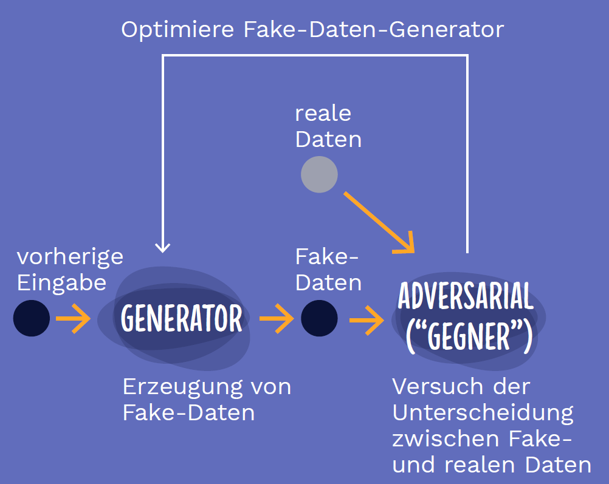

# Supervised Learning

Beim supervised Learning, also dem überwachten Lernen, haben wir es mit einer Menge von Daten zu tun, die bereits von Menschen kategorisiert bzw. verschlagwortet wurden. Es wird hierbei versucht, einen Algorithmus zu finden, der die Kategorisierungen bzw. Verschlagwortungen neuer Eingabedaten prognostiziert. 

## Künstliche Neuronale Netze

Hast du als Eingabedaten Texte, Bilder, Töne oder Videos, kannst du mit einem  Convolutional Neuronal Network den Rechner super lernen lassen, wie er den Inhalt selbiger erkennen kann. Dafür musst du nur eine sehr große Menge an Eingabedaten selbst beschriften und dann ein spezielles Neuronales Netzwerk sich damit beschäftigen lassen.

Das folgende Video erklärt dir die Grundidee dahinter:

<iframe width="560" height="315" src="https://www.youtube-nocookie.com/embed/cxCzhFVyUdw?origin=https://buch.informatik.cc&amp;iv_load_policy=3&amp;modestbranding=1&amp;playsinline=1&amp;showinfo=0&amp;rel=0&amp;enablejsapi=1" frameborder="0" allow="accelerometer; autoplay; encrypted-media; gyroscope; picture-in-picture" allowfullscreen></iframe>

<figcaption>Video bei <a href="https://youtu.be/cxCzhFVyUdw">YouTube</a> ansehen </figcaption>

Nun ist es aber manchmal echt mühsam das alles per Hand zu machen. Stell dir vor der Rechner soll Go spielen lernen. Dafür müssten wir jetzt millionen Go-Partien spielen und der Rechner diese analysieren. Einfach ist es, wenn der Rechner einfach gegen sich selbst spielt. Das beide Netze spielen gegeneinander und ein Schiedsrichter erklärt am Ende wer gewonnen hat. Beim nächsten Mal spielen beide etwas besser.

Das geht auch in ganz anderen Bereichen. Etwa beim erstellen von künstlichen Bildern (etwa Fake):

<figcaption>
Bild von [Iskender Dirik](https://id.vc/) und [Microsoft](https://news.microsoft.com/de-de/deep-learning-whitepaper/)
</figcaption>

So hat ein Neuronales Netzwerk gelernt täuschend echte Portraits von Menschen zu erstellen:

<figcaption>
Bild von [ThisPersonDoesNotExist.com](https://thispersondoesnotexist.com/) / Philip Wang
</figcaption>

t> Probiere es selbst aus: [ThisPersonDoesNotExist.com](https://thispersondoesnotexist.com/) 

## Entscheidungsbäume

Hast du strukturierte Daten, etwa alle Schulnoten deiner Schule oder die Daten aller Wohnungen aus deiner Stadt, dann eigenen sich für eine künstliche Intelligenz Entscheidungsbäume gut. Diese sind in der Realität oft deutlich weiterentwickelter und komplexer als normale Bäume, die wir in diesem Buch kennenlernen werden.