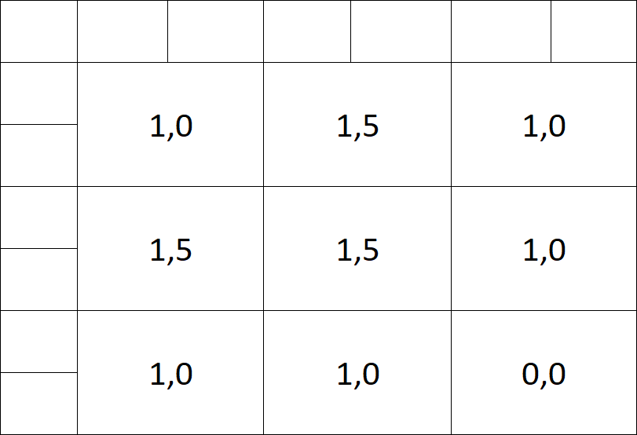

# Daten für ein künstliches neueronales Netz vorbereiten

Menschen nehmen Sinneseindrücke etwa durch Augen, Ohren oder die Haut auf. Dabei werden diese in elektrische Impulse umgewandelt, die in unserem Gehirn oder wenn es schnell gehen muss bereits im Rückenmark verarbeitet werden. Dabei nehmen wir nur einen Teil der Wirklichkeit war. So können wir etwa kein Ultraviolett sehen. Auch fallen uns manche Aspekte sehr schnell auf. So kann unser Gehirn Linien und Kanten sehr schnell zu geometrischen Figuren zusammensetzen oder bei einem Blick in die Wolken ein Gesicht erkennen.

Das gleiche Prinzip wollen wir jetzt auf unser Künstliches neuronales Netz übertragen. Dazu erschaffen wir eine schwache künstliche Intelligenz, welche folgende Aufgabe bewerkstelligen soll: 

Es soll zu erkennen, ob eine Fläche glatt ist, ein Karomuster besitzt oder von einer Linie durchkreuzt wird.

Du siehst die Bilder sind alle gleich groß und schwarzweiß. Wäre dem nicht so, müssten wir alle Bilder erst vereinheitlichen. Die Eingabemenge muss nämlich vergleichbar sein. In unserem Fall die gleichen Farben und die gleiche Größe. Unterschiedlich große Bilder könnte man zuschneiden oder erweitern und Graustufen umwandeln. Natürlich gehen auch HD-Fotos in HDR-Farbmodus - dann muss es nur ein anderes neuronales Netz sein.

t> Arbeite die Schritte am besten gleich nach. Dazu lädst du dir das [Tabellenkalkulationsdokument](/knn/assets/convolutional_network.xlsx ':ignore') herunter und kannst dann alle Schritte mitrechnen.

## Eingabe

Wir werden für das Beispiel mit dem folgenden Bild arbeiten:

## Bild in Zahlenwerten

Das der Rechner eigentlich keine Bilder kennt, weißt du bestimmt schon. In Wahrheit sind das alles Zahlenwerte, die geschickt auf dem Bildschirm dargestellt werden. Das machen wir hier auch: 

i> Der Profi wundert sich vielleicht, dass schwarz den Wert `255` und weiß den Wert `0` hat. Normalerweise ist das genau andersrum. Das könnte ich jetzt versuchen mit dem Ausspruchen "Wissen ist Nacht" von Professor Abdul Nachtigaller aus Kapitän Blaubär zu begründen, oder schlicht darauf verweisen, dass es egal ist. Hauptsache wir nehmen immer die gleichen Zahlen für gleiche Farben.

t> Wie könnte bei farbigen Bildern verfahren werden?

## Bild in normierten Zahlenwerten

Der Mathematiker normiert gern aus den verschiedensten Gründen. Auch, weil es sich dann entspannter rechnen lässt. Wir setzen hier den größten Wert auf `1` und den kleinsten auf `0`.

## zero-padding

Für den nächsten Schritt ziehen wir einen Rahmen um das ursprüngliche Bild und füllen diesen mit `0` auf. Wir ergänzen quasi einen leeren Rahmen.

## Filter

Ein Filter reduziert das Bild auf die benötigten Informationen. In unserem Fall möchten wir ja Muster erkenen, daher werden wir mit dem folgenden Filter das Muster noch weiter verstärken:

Denkbar wäre auch mit einem Filter etwa waagerechte Kanten oder in Musik nur sehr laute Töne zu finden. 

w> Mittlerweile werden Filter beim Lernprozess auch selbst gelernt. Wir gehen hier davon aus, dass diese durch einen Menschen vorgegeben sind.

## Feauture Map

Hier bilden wir aus dem Bild und dem Filter ein Summenprodukt.

Der graue Mittelpunkt des Filters wird nacheinander auf jeden Pixel des Bildes gelegt und anschließend auf den überlappenden Bereichen das Summenprodukt gebildet. 

Legen wir hier den grauen Punk auf den ersten Wert des ursprünglichen Bildes:

Jetzt bilden von den beiden Matrizen des pro [Frobenius-Skalarprodukt](https://de.wikipedia.org/wiki/Frobenius-Skalarprodukt). Bitte was?! Okay, also wir nehmen die Zahlen die an der gleichen Stelle stehen multiplizieren diese und addieren anschließend das Ergebnis. Für die erste Zeile wäre das: `0 * 0 + -0,5*0 + 0,5*0 = 0`. Garnicht schwer? Gut mit ein wenig nachdenken kommen wir drauf, dass wie hier eigentlich nur `1 *-0,5 +1 * -0,5 = -1 ` rechnen müssen. Das Ergebnis tragen wir dann in der Feuture Map an die selbe Stelle wie in der vorherigen Abbildung. 

Das Ergebnis für alle Elemente können wir dann in die Feauture Map eintragen. Dabei können wir den Rand aus dem zero-padding wieder entfernen:

Nur Bahnhof verstanden? Stell dir vor du hast ein Foto vom Strand gemacht und suchst alle roten Regenschirme. Also legst du eine halbdurchsichtige rote Folie darüber und schon siehst du nur noch rote Regenschirme, der Rest ist ganz grau geworden. Das gleiche haben wir hier mathematisch gemacht.

i> Du kannst in dem Tabellenkalkulationsdokument die einzelnen Zellen mit folgender Formel berechnen: `=SUMMENPRODUKT(C28:E30;$C$38:$E$40)`

## ReLU (**Rectified** Linaer Unit) Aktivierungsfunktion 

Und wir normieren erneut. Diesmal lassen wir alle negativen Werte weg: 

Die grauen Werte sind neu. DIe benötigen wir für die nächste Aufgabe.

## Max pool

Theoretisch könnten wir mit unserem Eingangsbild schon arbeiten. Das hätte aber den entscheidenden Nachteil, dass schon die Änderung in einen einzigen Pixel ein anderes Bild für den Rechner ergeben würde. Somit hätte man fast nie das gleiche Bild und der Rechenaufwand würde sehr stark steigen. Daher lassen wir Informationen weg (reduzieren quasi die Auflösung).

i> Der Experte sagt wir generalisieren das Bild.

In unserem Fall fassen wir je 4 Pixel zusammen und übernehmen nur den größten Wert:

## Flatten

Eigentlich gibt es keinen Grund das Bild weiterhin zweidimensional darzustellen. Muster haben wir ja bereits bei mit der Feauture Map herausgearbeitet. Also schreiben wir alle Werte in eine Zeile: 

Neu hinzugekommen ist die Konstante `-1`, welche für die BIAS-Berechnung benötigt wird. Der BIAS wird auch Schwellenwert genannt. Vielleicht erinnert ihr euch noch an das Video, dort wurde erlärt, dass damit eine notwendige Menge zusammenkommen muss, ehe das "Neuron" feuert. Genau das ist auch hier der Fall.

