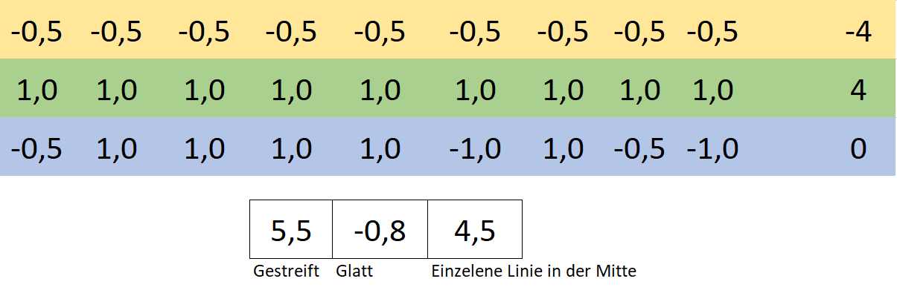
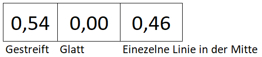

# Ein künstliches neuronales Netz entscheidet

Im letzten Abschnitt haben wir unsere Muster

in eine Zahlenfolge umgewandelt:

Neben der Zahlenfolge ist die Konstante `-1`, welche für die BIAS-Berechnung benötigt wird. Der BIAS wird auch Schwellenwert genannt. 

t> Arbeite die Schritte am besten gleich weiter mit. Dazu benötigst dazu das im letzten Schritt bereits ausgefüllte [Tabellenkalkulationsdokument](/knn/assets/convolutional_network.xlsx ':ignore') und kannst dann alle Schritte mitrechnen.

## Fully Connected Layer

Wir wollen entweder `gestreift`, `glatt` oder `einzelne Linie` erkennen. Dafür bilden wir im ersten Schritt vollkommen willkürlich die folgenden Zahlenreihen:

Grün steht für `gestreift`, `glatt` ist gelb und die `einzelne Linie` ist blau.

Sehen wir uns die Berechnung für gestreift an: Wir nehmen den ersten Wert `1,0` und multiplizieren diesen mit den ersten gelben Wert `0,5` , wiederholen das für alle Werte einschließlich dem BIAS und summieren die Ergebnisse. Wir erhalten `5,5` als Ergebnis.

i> Das heißt Summenprodukt und wurde auch im Kapitel [Daten für KNN vorbereiten](datenaufbereiten.md) im Abschnitt *Feauture Map* beschrieben.

Das ist tatsächlich schon die ganze Magie des neuronalen Netzwerks. Sicher kennst du aus Medien so tolle Darstellungen mit verschiedenen Schichten. Wir haben hier mathematisch genau das gleiche wie im Abschnitt [Wie entscheidet ein KNN?](fullyconnectedlayer.md.md) durchgeführt.

## Aktivierungsfunktion

Im nächsten Schritt wollen wir unser Ergebnis 

noch ein wenig überarbeiten, damit wir es für uns passender ausgeben können: Wir haben wir schon wieder einen negativen Wert. Das stört, um Wahrscheinlichkeiten berechnen zu können, daher lassen wir den wieder mit einer Aktivierungsfunktion verschwinden. Hier aber ein wenig veränderter ReLU. Die Summe bleibt zum vorherigen Beispiel bestehen:

## Normierung

Wurde schon erwähnt, wie gern der Mathematiker norminiert? Das machen wir hier erneut: 

Das Ergebnis bedeutet: Es ist auf keinen Fall ein glatte Bild. zu `54%` ist es gestreift und zu `46%` ist es eine einzelne Linie. Da gestreift am wahrscheinlichsten ist entscheide ich mich dafür.

Wir stellen fest, dass unser neuronales Netzwerk das Bild richtig erkannt hat. So wirklich verlassen würden wir uns bei zu 54% sicher aber nicht auf es.