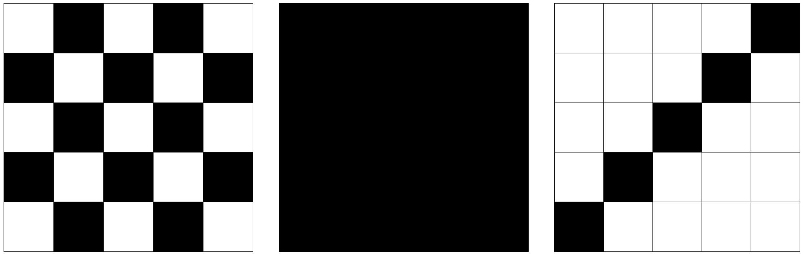
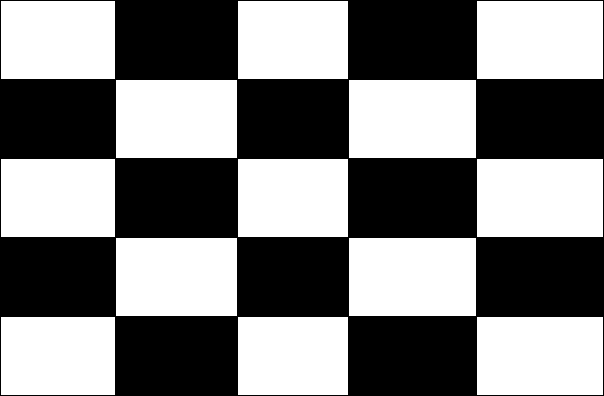
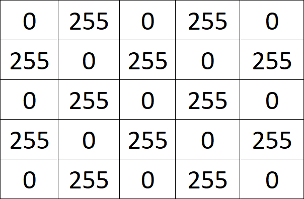
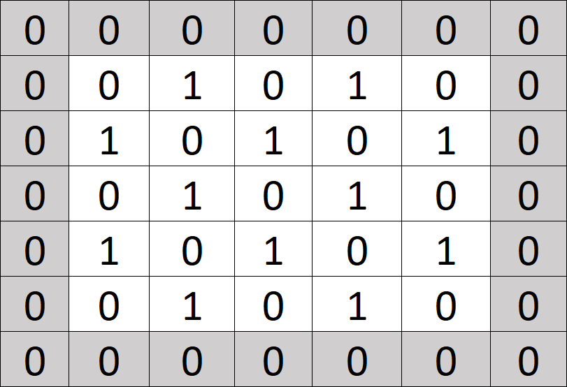
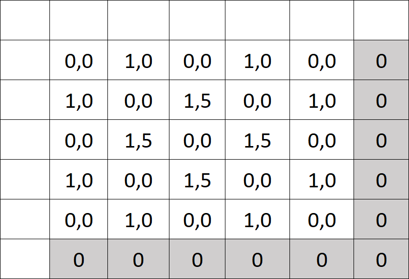

# Grundlagen künstlicher neueronaler Netze

In diesem Abschnitt lernen wir, wie neuronale Netze grundlegend lernen. Dabei konzentrieren wir uns auf die mathematischen Grundlagen.

## Künstliches neuronales Netz benutzen

In diesem Abschnitt werden wir ein neuronales Netz erstellen, welches in der Lage sein soll zu erkennen, ob eine Fläche glatt ist, ein Karomuster besitzt oder von einer Linie durchkreuzt wird:

Du siehst die Bilder sind alle gleich groß und schwarzweiß. Wäre dem nicht so, müssten wir alle Bilder erst vereinheitlichen. Die Eingabemenge muss nämlich vergleichbar sein. In unserem Fall die gleichen Farben und die gleiche Größe. Unterschiedlich große Bilder könnte man zuschneiden oder erweitern und Graustufen umwandeln. Natürlich gehen auch HD-Fotos in HDR-Farbmodus - dann muss es nur ein anderes neuronales Netz sein.

Die folgenden Abschnitte lassen sich wie folgt gliedern:

**Daten vorbereiten:**

1. Eingabe
2. Bild in Zahlenwerten
3. Bild in normierten Zahlenwerten
4. zero-padding
5. Filter
6. Feauture Map
7. Aktivierungsfunktion
8. Max pool
9. Flatten

**Das neuronale Netzwerk seine Arbeit machen lassen:**

1. Fully Connected Layer
2. Aktivierungsfunktion
3. Normierung

Du wir werden uns zuerst sehr lang damit beschäftigen, wie Daten aufbereitet sein müssen und erst dann das neuronale Netz wirklich nutzen.

### Eingabe

Wir werden für das Beispiel mit dem folgenden bild arbeiten:

### Bild in Zahlenwerten

Das der Rechner eigentlich keine Bilder kennt, weißt du bestimmt schon. In Wahrheit sind das alles Zahlenwerte, die geschickt auf dem Bildschirm dargestellt werden. Das machen wir hier auch: 

i> Der Profi wundert sich vielleicht, dass schwarz den Wert `255` und weiß den Wert `0` hat. Normalerweise ist das genau andersrum. Das könnte ich jetzt versuchen mit dem Ausspruchen "Wissen ist Nacht" von Professor Abdul Nachtigaller aus Kapitän Blaubär zu begründen, oder schlicht darauf verweisen, dass es egal ist. Hauptsache wir nehmen immer die gleichen Zahlen für gleiche Farben.

### Bild in normierten Zahlenwerten

Der Mathematiker normiert gern aus den verschiedensten Gründen. Auch, weil es sich dann entspannter rechnen lässt. Wir setzen hier den größten Wert auf `1` und den kleinsten auf `0`.

### zero-padding

Für den nächsten Schritt ziehen wir einen Rahmen um das ursprüngliche Bild und füllen diesen mit `0` auf. Wir ergänzen quasi einen leeren Rahmen.

### Filter

Ein Filter reduziert das Bild auf die benötigten Informationen. In unserem Fall möchten wir ja Muster erkenen, daher werden wir mit dem folgenden Filter das Muster noch weiter verstärken:

Denkbar wäre auch mit einem Filter etwa waagerechte Kanten oder in Musik nur sehr laute Töne zu finden. 

w> Mittlerweile werden Filter beim Lernprozess auch selbst gelernt. Wir gehen hier davon aus, dass diese durch einen Menschen vorgegeben sind.

### Feauture Map

Hier bilden wir aus dem Bild und dem Filter ein Summenprodukt.

Der graue Mittelpunkt des Filters wird nacheinander auf jeden Pixel des Bildes gelegt und anschließend auf den überlappenden Bereichen das Summenprodukt gebildet. 

Legen wir hier den grauen Punk auf den ersten Wert des ursprünglichen Bildes:

Jetzt multiplizieren wir einfach beiden Matrizen. Bitte was?! Okay, also wir nehmen die Zahlen die an der gleichen Stelle stehen multiplizieren diese und addieren anschließend das Ergebnis. Für die erste Zeile wäre das: `0 * 0 + -0,5*0 + 0,5*0 = 0`. Garnicht schwer? Gut mit ein wenig nachdenken kommen wir drauf, dass wie hier eigentlich nur `1 *-0,5 +1 * -0,5 = -1 ` rechnen müssen. Das Ergebnis tragen wir dann in der Feuture Map an die selbe Stelle wie in der vorherigen Abbildung. 

Das Ergebnis für alle Elemente können wir dann in die Feauture Map eingetragen:

Nur Bahnhof verstanden? Stell dir vor du hast ein Foto vom Strand gemacht und suchst alle roten Regenschirme. Also legst du eine halbdurchsichtige rote Folie darüber und schon siehst du nur noch rote Regenschirme, der Rest ist ganz grau geworden. Das gleiche haben wir hier mathematisch gemacht. Wie genau siehst du ausführlicher in der anschließenden Aufgabe.

### ReLU (Reacitivied Linaer Unit) Aktivierungsfunktion 

Und erneut normieren wird. Diesmal lassen wir alle negativen Werte weg: 

### Max pool

Theoretisch könnten wir mit unserem Eingangsbild schon arbeiten. Das hätte aber den entscheidenden Nachteil, dass schon die Änderung in einen einzigen Pixel ein anderes Bild für den Rechner ergeben würde. Somit hätte man fast nie das gleiche Bild und der Rechenaufwand würde sehr stark steigen. Daher lassen wir Informationen weg (reduzieren quasi die Auflösung).

i> Der Experte sagt wir generalisieren das Bild.

In unserem Fall fassen wir je 4 Pixel zusammen und übernehmen nur den größten Wert:

### Flatten

Eigentlich gibt es keinen Grund das Bild weiterhin zweidimensional darzustellen. Muster haben wir ja bereits bei mit der Feauture Map herausgearbeitet. Also schreiben wir alle Werte in eine Zeile: 

Neu hinzugekommen ist der BIAS. Auch Schwellenwert genannt. Vielleicht erinnert ihr euch noch an das Video, dort wurde erlärt, dass damit eine notwendige Menge zusammenkommen muss, ehe das "Neuron" feuert. Genau das ist auch hier der Fall.

### Fully Connected Layer

Bis hierhin war alles statisch. Hier konnt der Aspekt ins Spiel, wo gelernt werden muss:

Die farbigen Zeilen werden wir verändern, damit der neuronale Netzwerk die richtigen Ergebnisse liefert. Wie das geht lernen wir später. Für den Anfang haben wir die Werte einfach zufällig ausgewählt: 

Grün steht für `gestreift`, `glatt` ist gelb und die `einzelne Linie` ist blau.

Sehen wir uns die Berechnung für gestreift an: Wir nehmen den ersten Wert `1,0` und multiplizieren diesen mit den ersten gelben Wert `0,5` , wiederholen das für alle Werte einschließlich dem BIAS und summieren die Ergebnisse (wie in Feauture Map beschrieben).

i> Das ist tatsächlich schon die ganze Magie des neuronalen Netzwerks. Sicher kennst du aus Medien so tolle Darstellungen mit verschiedenen Schichten. [Hier](/neuronale_netze/assetes/Fully Connected Layer.pdf) ist der Prozess grafisch mit verschiedenen Ebenen erklärt.

### Aktivierungsfunktion

Wir haben schon wieder einen negativen Wert. Das stört und gleich, daher lassen wir den wider mit einer Aktivierungsfunktion verschwinden. Hier aber ein wenig vereinfachter ReLU. Die Summe bleibt zum vorherigen Beispiel bestehen:

### Normierung

Wurde schon erwähnt, wie gern der Mathematiker normiet? Das machen wir hier erneut: 

Das Ergebnis bedeutet: Es ist auf keinen Fall ein glatte Bild. zu 54% ist es gestreift und zu 46% ist es eine einzelne Linie. Da gestreift am wahrscheinlichsten ist entscheide ich mich dafür.

Wir stellen fest, dass unser neuronales Netzwerk das Bild richtig erkannt hat. So wirklich verlassen würden wir uns bei zu 54% sicher aber nicht auf es.

## Künstliches neuronales Netz trainieren

### Soll Zustand

Wie wir uns erinnern hatten wir ein gestreiftes Muster als Eingangsmenge. Das ist zu 100% sicher, also eine `1,0`. Die anderen beiden schließen wir aus also `0,0`. 

### Kosten

Hö? Das hier kostet was? Nicht ganz: Insgesamt hat sich unser neuronales Netzwerk zu `0,41` vertan. Man sagt auch es sind Kosten in folgender Höhe entstanden: 

Die Werte kommen daher, dass wir den errechneneten Wert vom Sollwert abgezogen haben und beides ins Quadrat genommen haben. Also etwa `(0,54-1)^2` (Ja, da kommt `2,11` raus. Das liegt daran, weil wir unterwegs so viel gerundet haben)

### Und wie lernt das künstliche neuronale Netz jetzt?!

Alles was wir eben einzeln gemacht haben, lässt sich ein eine einzige große Funktion packen. In dieser Funktion haben wir Variabeln. Nämlich die Werte aus dem Fully Connected Layer. 

Am Ende unser Funktion haben wir Kosten berechnet. Und diese Kosten wollen wir minimieren.

Was so einfach? Ja, so einfach. Eine kleine Funktion mit schlappen 30 Variabeln minimieren. 

In Mathe hast du sicher gelernt, dass man zum Bestimmen einer Variable immer eine Funktion benötigt. Also bei 30 Variabeln auch 30 Funktionen. Genau aus diesem Grunde werden wir hier auch raten. Raten? Jupp, was anderes bleibt uns ja nicht übrig. 

Etwas professioneller: Mithilfe passender Heuristiken werden wir mit vertretbarem Aufwand die Kostenfunktion möglichst weit reduzieren, sodass uns das Ergebnis so zuverlässig erscheint, dass wir damit arbeiten können.

Bitte lasst sich kurz auf folgendes Gedankenexperiment ein: Du bist ein Geograph und möchtest in einem großen Gebirge wie etwa den Alpen den niedrigsten Punkt erreichen. Im Idealfall hast du einen Helikopter und überfliegst die gesamten Alpen. Damit ermittelst du zielsicher den niedrigsten Ort. Da das aber zu aufwendig ist, lässt du dich einfach irgendwo in den Alpen absetzen und versuchst den niedrigsten Punk so zu finden: Du rennst natürlich einfach nach unten. Bist du ganz unten angekommen, könnte dies der niedrigste Punkt sein. Aber es könnte auch einfach nur ein hoch gelegenes Tal sein, und hinter dem nächsten Berg liegt ein viel tieferes Tal oder gar eine Schlucht. Daher bist du gezwungen, von dem Tal wieder aufzusteigen und noch einige andere Täler auszuprobieren. Anschließend kehrst du zu dem Tal mit den niedrigsten Punkt zurück.

So in etwa gehen die Algorithmen zur Minimierung der Kostenfunktion vor. Denn alle Täler können sie nicht besuchen, da dies nicht mehr berechenbar wäre.

Welche Täler man nun besucht und wie man überhaupt feststellt dass man in einem Tal und nicht schon wieder auf einer einsteige ist, dazu gibt es verschiedene Heuristiken. Etwa läuft man besonders schnell, wenn man offensichtlich noch sehr weit oben ist und wird immer langsamer je näher man seinem vermeintlichen Ziel kommt

### Übung

t> Bisher war das alles vielleicht ganz hübsch oder verwirrend. Jetzt bist du dran!

Lade dir das [Aufgabenblatt](/neuronale_netze/assets/Aufgabe Convolutional Netwerk.pdf) und das [Tabellenkalkulationsdokument](/neuronale_netze/assetes/Convolutional Network 0.4 - Share.xlsx) herunter und führe die oben beschriebenen Berechnungen alle praktisch durch.
